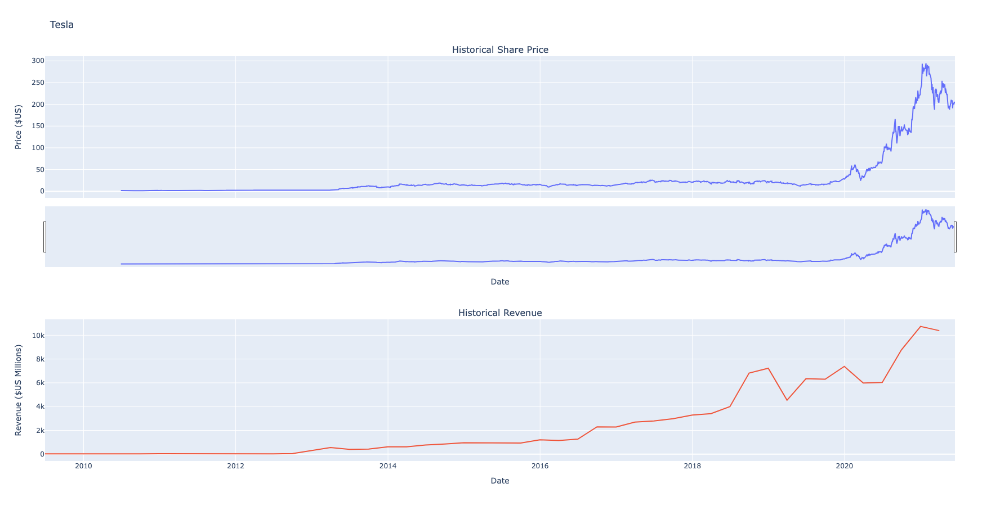
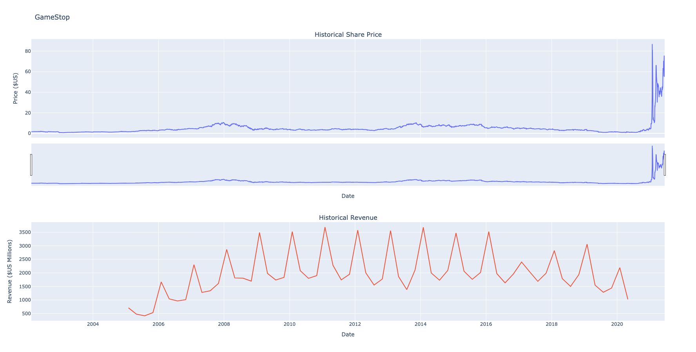

# Tesla and GameStop Stock and Revenue Analysis

## Project Overview

This project provides an analysis of historical stock market data and financial revenue for two publicly traded companies: Tesla (TSLA) and GameStop (GME). The primary goal is to fetch, clean, and visualize this data to compare the stock performance against the reported quarterly revenue.

The entire process is documented in a Jupyter Notebook, demonstrating skills in web scraping, data manipulation, and interactive data visualization.

https://eu-gb.dataplatform.cloud.ibm.com/analytics/notebooks/v2/b31d38d4-c9d5-4954-b4ca-01961a4f21f3/view?access_token=f54b861365730e2e9baa6af1cd9f0b932e7dfbdf277283c64954fc9fa2520a9a&context=wx

---

## Key Features

- **Data Extraction:** Fetches historical stock data using the `yfinance` library and scrapes revenue data from a financial webpage using `Requests` and `Beautiful Soup`.
- **Data Cleaning:** Processes and cleans the extracted data using the `Pandas` library. This includes handling missing values and converting financial strings (e.g., `$1,234`) into a numerical format for analysis.
- **Data Visualization:** Creates interactive, multi-plot graphs using `Plotly` to display stock prices and revenue data on a shared timeline.
- **Function Reusability:** Utilizes a helper function to plot the data for both companies, demonstrating modular and reusable code.

---

## Technologies Used

- **Language:** Python 3
- **Libraries:**
  - `yfinance`: For fetching historical stock market data from Yahoo Finance.
  - `pandas`: For data manipulation, cleaning, and analysis.
  - `requests`: For making HTTP requests to a webpage.
  - `beautifulsoup4`: For parsing HTML and XML documents to scrape data.
  - `plotly`: For creating interactive and publication-quality graphs.
- **Environment:** Jupyter Notebook

---

## How to Run This Project

1.  **Clone the repository:**
    ```bash
    git clone https://github.com/cakmakbm/stock-market-data-analytics
    ```

2.  **Install the required libraries:**
    ```bash
    pip install yfinance pandas requests beautifulsoup4 plotly nbformat
    ```

3.  **Run the Jupyter Notebook:**
    Open the `teslagme2.ipynb` file in Jupyter Notebook, JupyterLab, or VS Code and run the cells sequentially.

    ```bash
    jupyter notebook teslagme2.ipynb
    ```

---

## Final Visualization

The output of this analysis is a dashboard-style plot for each company, showing the historical share price alongside the historical revenue. This allows for a visual correlation between the company's financial performance and its market valuation.




